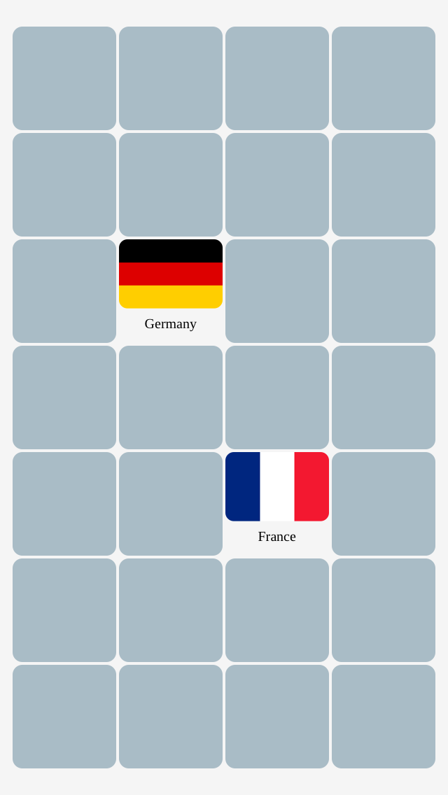

# Memory (game)

Find all the matching pairs of flags by turning over 2 cards at a time. 
Learn more than 240 flags of all countries of the world and dependent territories. 

## Description

**Memory**, also known as **Concentration**, **Match Match**, **Match Up** , **Pelmanism**, **Shinkei-suijaku**, **Pexeso** or simply **Pairs**, is a card game in which all of the cards are laid face down on a surface and two cards are flipped face up over each turn. The object of the game is to turn over pairs of matching cards.

## Screenshot

  

## License

Copyright &copy; 2020 Alexander Berson. This project is licensed under the [MIT license](LICENSE.txt "MIT License").